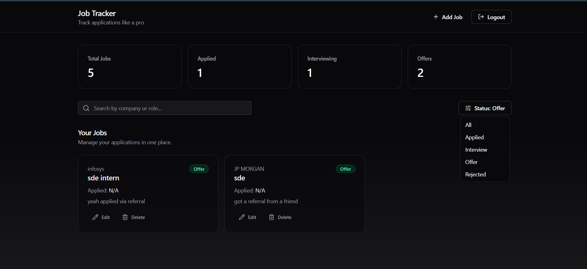
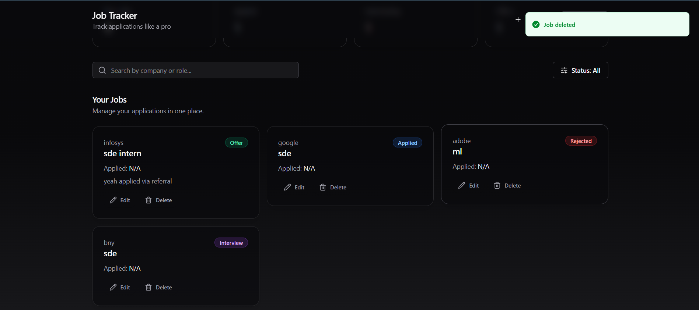

# 🚀 MERN Job Tracker (Modern Dashboard UI)

A full-stack **Job Tracker web app** built using the **MERN stack** with a modern SaaS-style UI (Tailwind + shadcn/ui + Framer Motion).  
Track job applications with full CRUD support, filters, search, and authentication.

---

## ✨ Features

### 🔐 Authentication
- Register new user
- Login user
- JWT-based auth
- Protected routes

### 📌 Job Management (CRUD)
- Add job
- Edit job
- Delete job
- View all jobs

### 🔎 Dashboard UI
- Summary cards (Total / Applied / Interview / Offer / Rejected)
- Search by company/role
- Filter by status
- Clean responsive grid layout
- Premium UI components (shadcn/ui)
- Subtle animations (Framer Motion)

---

## 🖼️ Screenshots

| Dashboard | Add Job |
|----------|---------|
|  |  |

| Search | Delete |
|-------|--------|
|  |  |

| Login |
|------|
|  |

---

## 🛠️ Tech Stack

### Frontend
- React (Vite)
- Tailwind CSS
- shadcn/ui
- lucide-react icons
- Framer Motion animations
- Axios

### Backend
- Node.js
- Express.js
- MongoDB + Mongoose
- JWT Authentication

---

## 📂 Folder Structure

job-tracker/
│
├── backend/
│ ├── config/
│ ├── middleware/
│ ├── models/
│ ├── routes/
│ ├── server.js
│ ├── package.json
│ └── .env (ignored)
│
├── frontend/
│ ├── src/
│ ├── public/
│ ├── index.html
│ ├── vite.config.js
│ ├── package.json
│ └── ...
│
├── screenshots/
│
├── .gitignore
└── README.md

### 1️⃣ Clone the Repository
```bash
git clone https://github.com/<your-username>/job-tracker.git
cd job-tracker
cd backend
npm install

Create .env inside /backend
Example:

PORT=5000
MONGO_URI=your_mongodb_connection_string
JWT_SECRET=your_secret_key

 Run backend server
npm start


🎨 Frontend Setup
 Open a new terminal and go to frontend folder
cd frontend

 Install frontend dependencies
npm install

 Run frontend
npm run dev


Frontend will run on:

http://localhost:5173

🔗 API Endpoints
Auth Routes

POST /api/auth/register

POST /api/auth/login

Job Routes

GET /api/jobs

POST /api/jobs

PUT /api/jobs/:id

DELETE /api/jobs/:id

Notes / Important
✅ Axios Base URL Setup

Frontend Axios instance uses:

baseURL: "http://localhost:5000/api"


So API calls should look like:

api.post("/auth/login")
api.get("/jobs")


⚠️ Do NOT write:

api.post("/api/auth/login")


because it becomes:

http://localhost:5000/api/api/auth/login
