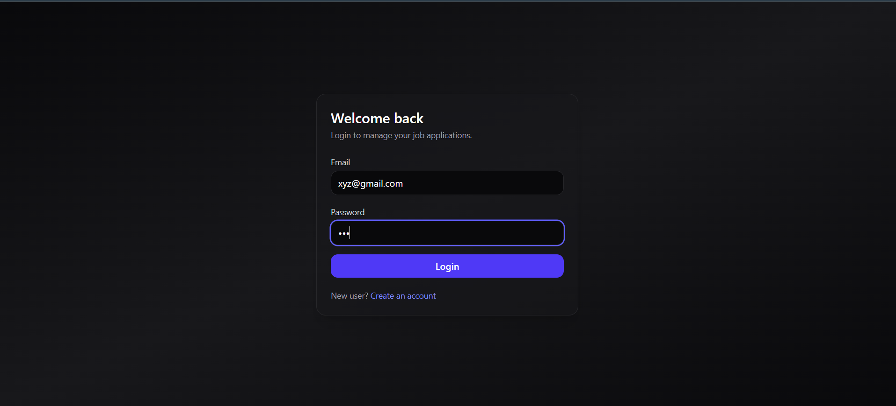
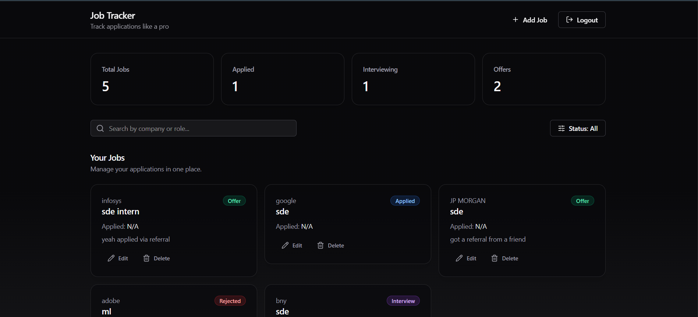
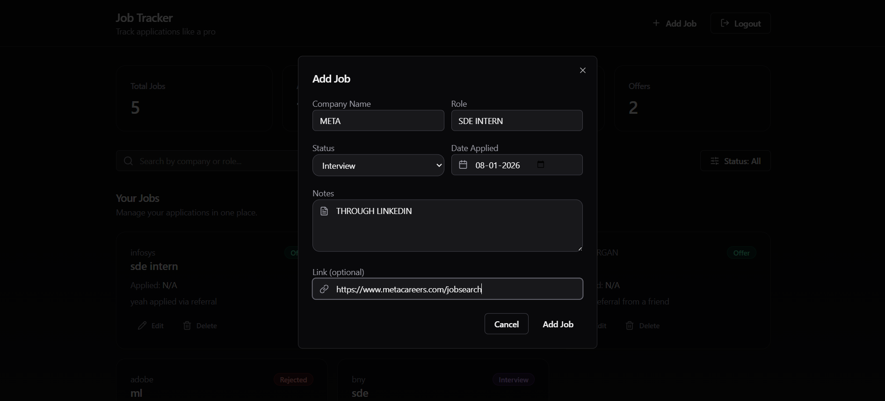

# Job Tracker (MERN)

A modern **MERN Job Tracker** web app to manage job applications with a clean, premium dashboard UI.

Built with **React + Tailwind + shadcn/ui** on the frontend and **Node.js + Express + MongoDB** on the backend.

---

## ✨ Features

- 🔐 Authentication (Register / Login)
- 🧾 Add / Edit / Delete job applications
- 🔎 Search jobs by company or role
- 🎯 Filter jobs by status (Applied / Interview / Offer / Rejected)
- ⚡ Instant UI updates after CRUD actions
- 🧊 Loading skeletons + toast messages
- 📱 Fully responsive modern UI

---

## 🖼️ DEMO

> Add images in a `/screenshots` folder in the project root.

### Login


### Dashboard


### Add Job Modal


### Jobs List


---

## 🛠️ Tech Stack

### Frontend
- React (Vite)
- Tailwind CSS
- shadcn/ui
- Framer Motion
- Lucide Icons
- Axios

### Backend
- Node.js
- Express.js
- MongoDB
- JWT Authentication

---

## 🚀 Getting Started (Local Setup)

### 1️⃣ Clone the repo
```bash
git clone https://github.com/<your-username>/job-tracker.git
cd job-tracker
